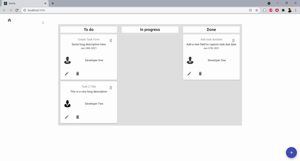
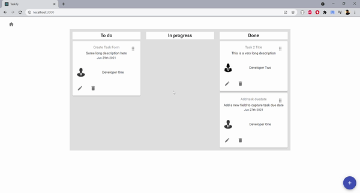
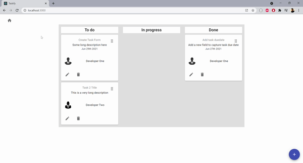

# Project Taskify

A simple task management web application using React, Redux Toolkit and Material UI

## Requirements

- Node - 14.0.0
- npm - 6.14.4

## Getting started

- yarn start
- visit http://localhost:3000

## Technologies used

- React
- Typescript
- Redux Toolkit (for state management)
- Localstorage (used to persist tasks)
- Material UI (react component library)
- Formik (for building forms with validations)
- React Router

## Pages

Defined in src/routes.ts and src/pages

| Name             | Path        | Description                                                                      |
| ---------------- | ----------- | -------------------------------------------------------------------------------- |
| Home             | /           | This is the default landing page after the onboarding process has been triggered |
| On Boarding      | /onboarding | Simple page to ask a user to add their first task                                |
| Add/Create task  | /task       | Displays a form to add a task                                                    |
| Update/Edit task | /task/:id   | Displays a form to edit/update a task 

## How tos
### Add a task
- Navigate to [home page](http://localhost:3000) 
- Click the add button (+) at the bottom right corner, and should navigate to the create task page
- Fill out the form and submit the form and should navigate to the task details page




### Updating task status using drag and drop
From the home page, a user can drag and drop a task accross workflow statuses to update/set workflow status


### Editing/Updating a task
A user can click on the edit icon of a task card to display a task form dialog. From the dialog, a user can choose to open the form in a window/new tab.
                                           |


## Data/Entity models (see src/models)

### Task - a simple interface structure representing a task. A task has the following fields

```
interface ITask {
    // Autogenerated UUID
    id: string;
    // Short Title of task (max 100 characters)
    title: string;
    // Short Description of task (max 500)
    decription: string;
    // task due date (optional)
    dueDate?: string | Date;
    // Workflow status of the task (default: todo) (todo, inprogress, done)
    status: WorkflowStatus;
    // Id of user assigned to the task (reference to user model)
    assignedTo: string | IUser;
}
```

### User - a simple interface structure representing a user. A user has the following fields

```
interface IUser {
    // Autogenerated UUID
    id: string;
    // Firstname and Lastname of a user
    name: string;
    // Local link/path to photo
    avatar: string;
}
```

## Gallery


